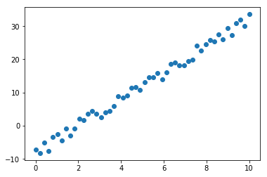
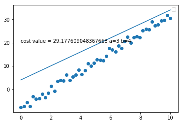
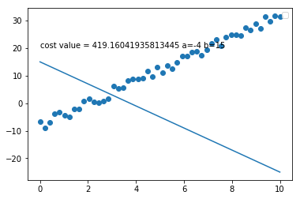
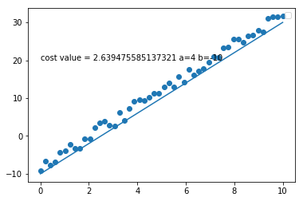
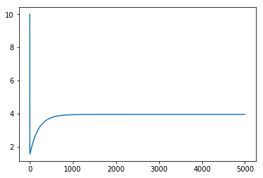
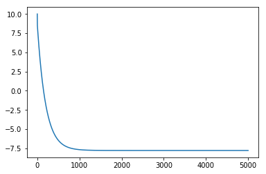
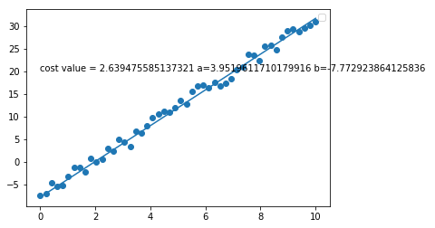

```python
<script type="text/javascript"
        src="https://cdnjs.cloudflare.com/ajax/libs/mathjax/2.7.0/MathJax.js?config=TeX-AMS_CHTML"></script>
<script type="text/javascript"
        src="https://cdnjs.cloudflare.com/ajax/libs/mathjax/2.7.0/MathJax.js?config=TeX-AMS_CHTML"></script>


%matplotlib inline
import matplotlib.pyplot as plt
import numpy as np
import math
from mpl_toolkits.mplot3d import Axes3D
from random import random
```

# Linear Regression

##### author: Daodeiv

### Intro

###### LR is basic and comonly used type of predictive analysis.Also linear regression is verry old way for finding the math model over the experimental data ,because every experiment has a noice(error measurments ) with some standart deviation , the linear regression volume down the noice.
###### The overall idea of regression is to examine two things 
###### 1) does a set of predictor variables do a good job in prediction an outcome (dependent) variable ?
###### 2)Which variables in paricular are significat predictorsof outcome variable,and in what wau do they-indicated by the magnitude and sign of the beta estimates–impact the outcome variable?

### Methods 

###### Let's  to define a lienear  function with some noice


```python
def our_function(show='False'):
    """
    our fuction wich will be investigated bellow
    """
    a =4
    c =-10
    f = lambda x : a*x + c + np.random.uniform(0,4)
    x_args = np.linspace(0,10)
    y_args = [f(i) for i in x_args]
    plt.scatter(x_args,y_args)
    if show:
        ##plt.show()
        pass

def plot_function(a,b,cost,show='False'):
    """
    f(x) = ax +b
    takes
    cost the value of cost function
    ploting the linear function 
    
    """
    f = lambda x,a,b : a*x +b
    l = "{}*x_i + {}".format(a,b)
    x_args = np.linspace(0,10)
    our_function()
    y_args = [f(i,a,b) for i in x_args]
    plt.plot(x_args,y_args)
    plt.text(0,20,"cost value = {} a={} b={} ".format(str(cost),a,b))
    if show:
        plt.legend()
        plt.show()
    
```

###### Our goal is  to find the function f= a*x+b which describe  X and Y values  in approximatly most better way


```python
our_function()
```


    

    


#### Every linear function is charactarised with two parameterns a and b where a is measure of tg(<a) between the line and x-line ,and b is the interecept of function,we have to find the parameter a,b 
#### We have to find the formula wich give us the mesurments of errors depends on a and b J(a,b)  


##### The most used Error function or so called Cost function  is  $J(a,b)= (y_ipredict-y_iactual)^2$
##### Total cost function $\frac{1}{2*n}\sum_{n=1}^{n}{(y_ipredict-y_iactual)^2}$ 


##### why above    function is good ?
##### 1) first because it give us the abosolute diference between predicted value and actual vaulu
##### 2) the funcction is differentiable function in every point(in belowe we will se why this so importent)
##### 3) !!! remember our purpose is to find where $\sum_i{(y_ipredict-y_iactual)^2}$  get minimum value not what is this value

##### in more detail written the function looks like this  
 $$\frac{1}{2*n}\sum_{n=1}^{n}{(y_ipredict-y_iactual)^2}=\frac{1}{2*n}\sum_{n=1}^{n}{(y_ipredict-a*x_i + b)^2} $$ 


```python
def cost(a,b,x_args,y_actual_args):
    """
    takes a_predict,b_predict predict value for a and b
    takse x_args,y_actual_args actual values 
    return the the value of cost function
    """
    
    f = lambda x,a,b : a*x + b
    y_actual = np.array(y_actual_args)
  
    y_predict = np.array([f(i,a,b) for i in x_args])
#     print(y_predict.shape)
#     print(y_actual.shape)
    cost = (((y_predict-y_actual)**2).sum())/(2*len(x_args))
    print('for a={} and b={} the cost function give result {}'.format(a,b,cost))
    return cost
    

    

```


```python

```


```python
f = lambda x : 4*x -10 + np.random.uniform(0,4)
x_args = np.linspace(0,10)
y_args = [f(i) for i in x_args]
#print(str(y_args))
```

### lets to see the size of cost function in diferent a and b


```python
a=3
b=4
value = cost(a,b,x_args,y_args)
value=(str(value))
plot_function(a,b,value)
```

    No handles with labels found to put in legend.
    

    for a=3 and b=4 the cost function give result 29.177609048367668
    


    

    


#### HERE  for a=3 and b=4 the total cost value is 29.177609048367668
### !!! NOTE !!! We are not interested in how is the  size of lost function is big,out goal os to find for wich a,b this dunction has min value


```python
a=-4
b=15
value = cost(a,b,x_args,y_args)
value=(str(value))
plot_function(a,b,value)
```

    No handles with labels found to put in legend.
    

    for a=-4 and b=15 the cost function give result 419.16041935813445
    


    

    


#### HERE We can see that the lost value 419.16041935813445 and times more bigger then above example ,and we can see that the function with a=-4 , b=15 modeling the data much worse


```python
a=4
b=-10
value = cost(a,b,x_args,y_args)
value=(str(value))
plot_function(a,b,value)
```

    No handles with labels found to put in legend.
    

    for a=4 and b=-10 the cost function give result 2.639475585137321
    


    

    


####  When a=4 and b=-10  it seem that the function descrive the data verry well and the lost function has 
##### result 2.639475585137321 wich much less then the above examples, maybe this is a min value but we have to create the algorithm which will find the min value of J (a, b ) depends of a,b 

### In mathematical analisis has Rolle's Theorem ,which is used for finding the min of 
### function .The condition is when f'(x) = and f(x+e) - f(x) >0 then x has a local minum
but we will use numerical appraoch for findimg minum called  <a href='https://github.com/Daodavid93/Machine-Learning-first-steps/blob/master/Regresion%20Model/gradient%20descent.ipynb'>GRADIENT DESCENT</a> .This method is explained 
Gradient Descent:
 The Lost function $J(a,b) = \sum_{n=1}^{n}{(a*x_i + b - y_ipredict)^2}$
 alogoritms
 $$a = a - \nabla_a(J(a,b)*h$$
  $$b = b - \nabla_b(J(a,b)*h$$
##### where h is learning rate or step size
$$\nabla_a(J(a,b)=\frac{\partial{J}}{\partial{a}}=\frac{1}{n}\sum_{n=1}^{n}*{(y_ipredict-a*x_i + b)*x_i} $$
$$\nabla_a(J(a,b)=\frac{\partial{J}}{\partial{b}}=\frac{1}{n}\sum_{n=1}^{n}\frac{1}{n}*{(y_ipredict-a*x_i + b)} $$


```python
def perform_gradient_descent(x_args , y_actual,learning_rate=0.01,init_a=10,init_b=10,iteration=5000,debug=False,return_result_array=False):
    """
   
    """
    a = init_a
    b= init_b
    a_args = []
    b_args = []
    x = np.array(x_args)
    y = np.array(y_actual)
    for i in range(iteration):
        #gradient_a =((((np.array(y_actual) - (a*np.array(x_args)  +b))*x_args).sum())* (2/len(x_args))) 
        #gradient_b = (((np.array(y_actual) - (a*np.array(x_args)  +b)).sum())* (2/len(x_args)))
        a_gradient = -2 / len(x_args) * np.sum(x * (y - (a * x + b)))
        b_gradient = -2 / len(x_args) * np.sum(y - (a * x + b))
        new_a = a - a_gradient*learning_rate
        new_b = b - b_gradient*learning_rate
        a_args.append(a)
        b_args.append(b)
        a = new_a
        b=new_b
        if debug :
            print('a = {} , b = {}'.format(a,b))
            print('grad a = {} , grad b = {}'.format(a_gradient,b_gradient))
            
    if return_result_array:
        return x_args,a_args,b_args
    else :
        return a,b
            
    

    
    
    
    
```


```python
x,a,b = perform_gradient_descent(x_args,y_args,return_result_array=True)
plt.plot(a)
plt.show()
plt.plot(b)
```


    

    


    [<matplotlib.lines.Line2D at 0xd2dda92860>]


    

    


```python
a,b = perform_gradient_descent(x_args,y_args)

plot_function(a,b,value)
```

    No handles with labels found to put in legend.
    


    

    


### Our Model is super

Lets to define class LinearRegression


```python

class LinearRegression:
    """
    Custom linear regression implementation
    
    """
    def __init__(self,learning_rate)
        self.coef_=Nan # coefs a
        self.intecept_=Nan # b  #y= ax+b
        self_learning_rate =learning_rate # step of gradient decent minimazation
        
    def train(self,X_data,y_data,learning_rate=0.01):
        """
        traing the linear model
        
        """
        self.x = X_data
        self.y = y_data
        
        pass
    def __perform_gradient(self):
        """
        """
        pass
    
    def __lost(self):
        pass
    
    def __cost(self):
        pass
    
    
```


